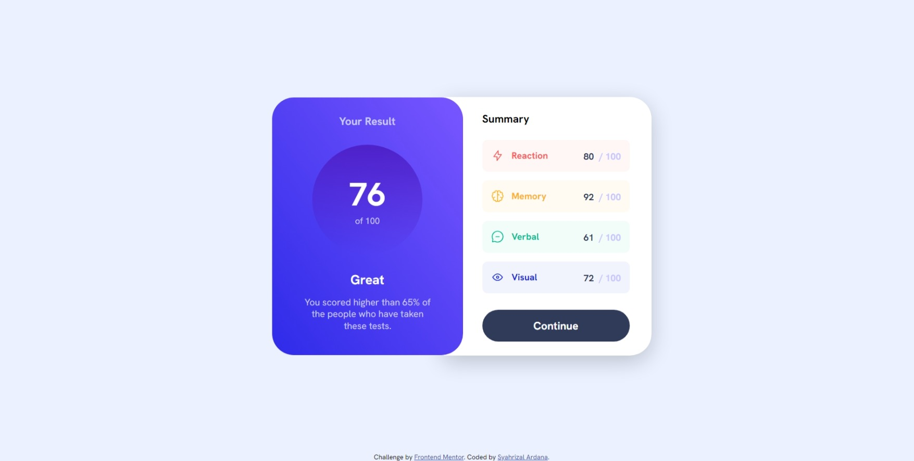
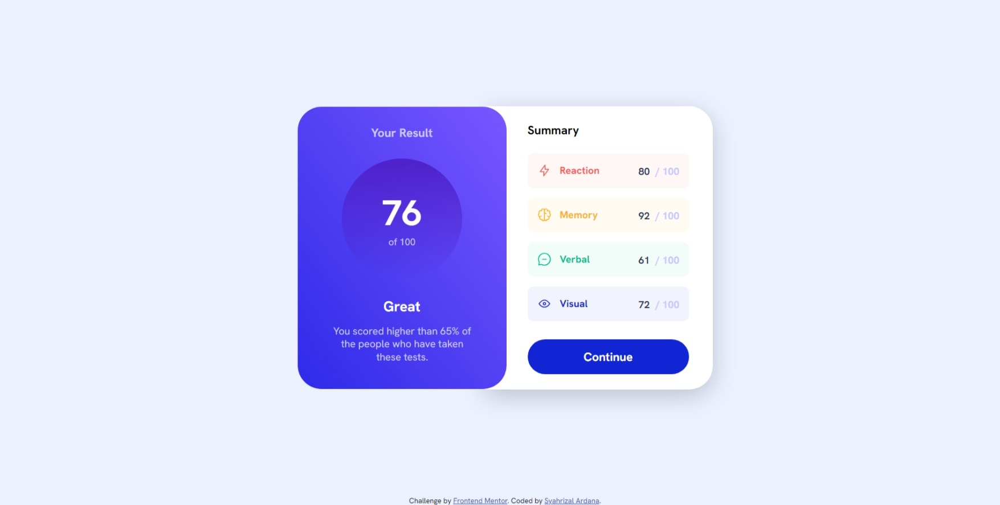

# Frontend Mentor - Results summary component solution

This is a solution to the [Results summary component challenge on Frontend Mentor](https://www.frontendmentor.io/challenges/results-summary-component-CE_K6s0maV). Frontend Mentor challenges help you improve your coding skills by building realistic projects.

## Table of contents

- [Overview](#overview)
  - [The challenge](#the-challenge)
  - [Screenshot](#screenshot)
  - [Links](#links)
- [My process](#my-process)
  - [Built with](#built-with)
  - [What I learned](#what-i-learned)
  - [Useful resources](#useful-resources)
- [Author](#author)
- [Acknowledgments](#acknowledgments)

## Overview

### The challenge

Users should be able to:

- View the optimal layout for the interface depending on their device's screen size
- See hover and focus states for all interactive elements on the page
- **Bonus**: Use the local JSON data to dynamically populate the content

### Screenshot

- Mobile


---



---



### Links

- Solution URL: [https://www.frontendmentor.io/solutions/results-summary-component-X6HrQwemxW](https://www.frontendmentor.io/solutions/results-summary-component-X6HrQwemxW)
- Live Site URL: [https://fm-results-summary-component-delta.vercel.app/](https://fm-results-summary-component-delta.vercel.app/)

## My process

### Built with

- Semantic HTML5 markup
- Flexbox
- Mobile-first workflow
- [SCSS](https://sass-lang.com/) - For styles
- [JQuery](https://jquery.com/) - For Populate JSON data

### What I learned

Using JQuery

- Intialize this first

```js
$(document).ready(function () {
  // Your code here
});
```

- Select element

```js
$(".cards"); // By class
$("#button"); // By id
```

- Fetching JSON Data

```js
$.getJSON("yourData.json", function (result) {
  $.each(result, function (index, data) {
    console.log(data);
  });
});
```

- Chaining

```js
const $card = $("<div>").addClass(`card ${data.category}`);
$card.append(
  $("<div>")
    .addClass("category")
    .append($("").attr("src", data.icon).attr("alt", data.category))
    .append($("<span>").addClass(data.category).text(data.category))
);
```

### Useful resources

- [JQuery Cheat Sheet](https://oscarotero.com/jquery/)

## Author

- Website - [Syahrizal Ardana](https://syahrizal-portfolio.vercel.app)
- Frontend Mentor - [@Gombeng](https://www.frontendmentor.io/profile/Gombeng)
